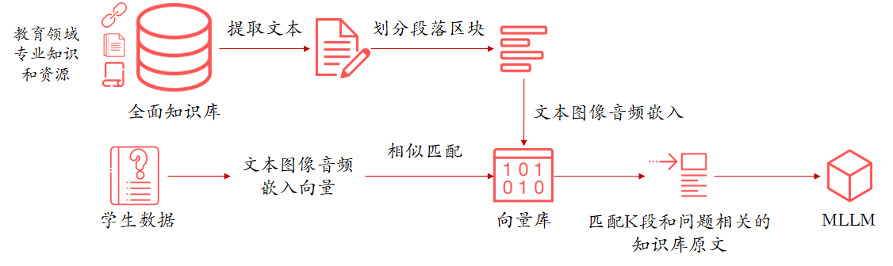

# MindEdu

MindEdu是一个基于人工智能技术的教育系统，旨在通过全面收集学生课堂状态信息，利用先进的AI模型对课堂行为进行分析，最终生成学生的综合素质评价报告。该系统通过创新技术，结合多模态大模型，推动教育评价的精准化和个性化，帮助教师、家长以及教育决策者全面了解学生的成长情况。

## 核心功能与技术创新

1. **学生课堂行为与情感识别**  
   MindEdu通过整合YOLO、CLIP、OpenCV等先进技术，能够精准捕捉学生的课堂行为和情感状态。YOLOv8模型用于姿态识别，精准捕捉学生的动作（如举手、写字、翻书等），反映学生的课堂参与度和听课状态。而CLIP模型则结合图像与文本语义，识别学生的表情和情绪（如专注、困惑、疲惫等），为教师提供全面的教学反馈，帮助其实时调整教学策略。
   

2. **LoRA微调技术**  
   系统采用LoRA（Low-Rank Adaptation）技术对大模型进行微调，以提升模型的教育适配性。通过冻结预训练模型的大部分参数，只训练新增的LoRA层，MindEdu能够显著降低计算资源的消耗并提升训练效率。团队构建了一个高质量的微调数据集，涵盖教育部政策、教材、学术论文等多源数据，确保模型生成的报告更加精准和符合教育领域的需求。
   

3. **RAG技术增强内容生成的准确性与可靠性**  
   RAG（Retrieval-Augmented Generation）技术被引入以提升模型生成内容的准确性。MindEdu通过构建一个涵盖教育领域专业知识的知识库，结合信息检索和生成技术，提高大模型生成报告时的上下文相关性。系统能够从知识库中精确检索相关信息并将其结合到报告生成过程中，减少“幻觉”现象并增强生成内容的可信度。
   

4. **自动化综合素质报告生成**  
   在收集并处理学生课堂表现、成绩等数据后，MindEdu将这些数据传输到多模态大模型GLM-4-9B中。该模型自动生成详尽的学生综合素质评价报告，涵盖学生的学习态度、知识掌握情况等多个维度。这些报告不仅提供了对学生的全面评价，还支持个性化定制和动态追踪，帮助教师和家长清晰了解学生的成长进程。

5. **华为数字人技术辅助报告展示**  
   为了使评价更加直观，MindEdu借助华为数字人技术生成视频报告，提供更生动、直观的展示方式。这些视频报告能够帮助学校、教师、家长等群体全面理解学生的课堂表现和成长情况。

## 技术路线

MindEdu的技术架构涵盖了数据采集、模型微调、检索增强和报告生成四大模块，确保各模块之间的高效协作，共同提供精准的教育评价服务。

1. **数据采集与预处理**  
   通过YOLO、CLIP、OpenCV等技术，MindEdu能够全面记录学生的课堂表现，进行表情识别和行为分析，为后续的教育评价和教学改进提供精准的数据支持。

2. **模型微调与优化**  
   使用LoRA微调技术，MindEdu对ChatGLM大模型进行了优化，使其更好地适应教育领域的需求，并能够准确理解和生成与教育内容相关的文本。

3. **检索增强生成**  
   RAG技术的引入使得系统能够结合知识库中的信息，提升报告生成的准确性和丰富性，从而为教育者提供更可靠的评估依据。

4. **自动化报告生成与展示**  
   在数据处理和模型微调的基础上，系统能够自动生成学生的综合素质评价报告，并通过华为数字人技术展示动态视频报告，进一步增强报告的可理解性和互动性。

## 技术框架

MindEdu的技术框架自下而上涵盖了从硬件基础设施到用户交互的各个关键层面，形成了一个完整的技术生态系统。

1. **用户交互层**  
   包括Web端、移动端、数据可视化和UI设计工具，为用户提供便捷的访问渠道和友好的操作界面。

2. **AI开放服务层**  
   包含数据处理、算法开发、模型训练与部署等核心功能，确保系统的稳定运行和高效服务。

3. **数据层**  
   提供多样化的数据支持，包括词向量表示、图像与文本桥梁、音频生成等，为系统提供强大的数据支撑。

4. **AI软件层**  
   包括LoRA微调技术、RAG生成技术、YOLO与CLIP模型等核心技术，支持模型的优化与部署，确保教育任务的高效完成。

5. **AI硬件层**  
   提供高效的硬件平台支持，包含计算能力强大的AI开发板和其他基础设施，保障系统的高效运转。
